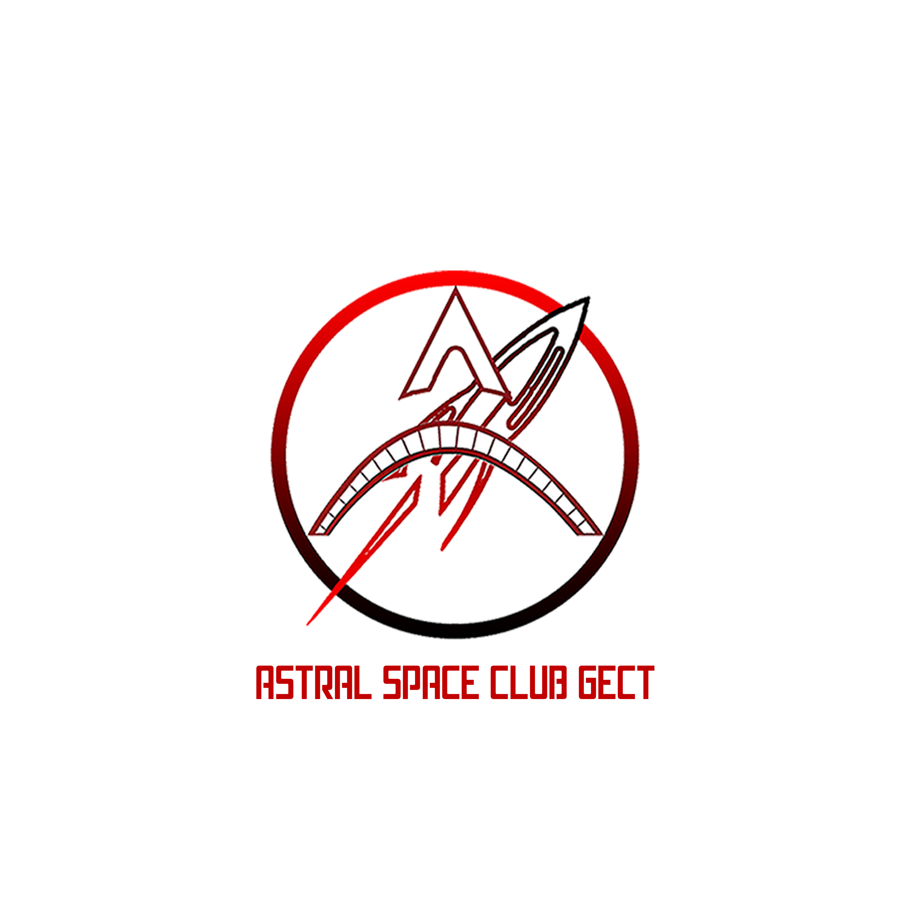

# Welcome to the Official Website of Astral Space Club GECT!

Explore the wonders of the cosmos with the Astral Space Club at Government Engineering College, Thrissur (GECT). Our mission is to ignite a passion for astronomy and space exploration among students, fostering a community that reaches for the stars and seeks to understand the universe.

## About Us
At Astral Space Club GECT, we believe that the universe is a vast playground of mysteries waiting to be unraveled. Founded by a group of enthusiastic students with a shared love for astronomy, our club aims to create a space where members can come together to learn, discuss, and marvel at the celestial marvels above.

## What We Do
Stargazing Nights: Join us for mesmerizing stargazing sessions where you'll get a chance to observe planets, stars, and constellations through our high-quality telescopes. Our seasoned astronomers will guide you through the night sky, revealing its hidden treasures.

Lectures and Workshops: Delve into the fascinating world of space science through our engaging lectures and workshops. From understanding the life cycle of stars to learning about the latest advancements in space technology, there's always something new to discover.

Astronomy Trips: Embark on journeys to observatories, planetariums, and other astronomical landmarks. These trips offer a hands-on experience and a deeper insight into the tools and techniques used by astronomers.

Community Engagement: We believe in spreading the knowledge and wonder of space beyond our club's walls. Look forward to our interactive sessions and outreach programs aimed at local schools and communities.

Website link: https://astralspaceclub.gectcr.ac.in/
